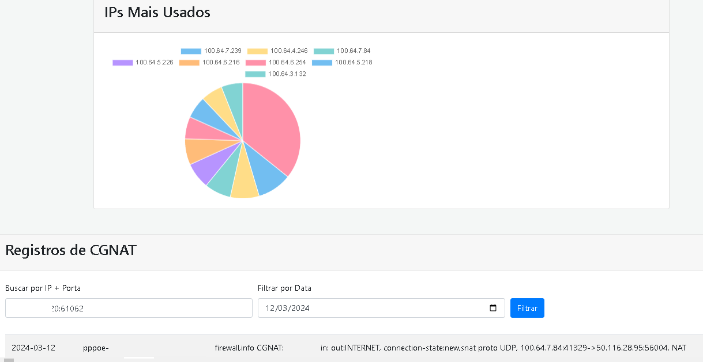

<p align="center">
  
</p>
# CGNAT Logger


## 📌 Sobre o Projeto

**CGNAT Logger** é uma aplicação em **PHP** que coleta e armazena logs de CGNAT enviados **exclusivamente por dispositivos Mikrotik RouterOS**.  
A imagem Docker inclui tudo que você precisa: **MariaDB**,**Syslog-NG**,**NGINX** — sem dependências externas.

---

## 🛠️ Requisitos

- Dispositivo Mikrotik configurado como BRAS, idealmente com CGNAT e PPPoE
- Docker e Docker Compose instalados

---

## 🚀 Como Usar

### 1. Clonar o repositório

```bash
git clone https://github.com/seu_usuario/cgnat_logger.git
cd cgnat_logger
mkdir -p -v mysql && chmod -R 755 logs/
mkdir -p -v logs && chmod -R 755 logs/
docker-compose up -d
```

### 2. Subir com Docker Compose
Copie todo o conteudo abaixo e crie um arquivo docker-compose.yml para rodar, ou, se utiliza alguma ferramenta como portainer, crie uma nova stack com esse mesmo codigo.

```bash
---
services:
  cgnatlogger:
    image: grandow/cgnatlogger:beta4
    container_name: cgnatlogger
    restart: always
    volumes:
      - "./mysql:/var/lib/mysql"
      - "./logs:/var/log/mikrotik"
    environment:
      - TZ=America/Sao_Paulo
      # Endereço IP do(s) BRAS 
      - MIKROTIK_IPS=10.0.0.1
      #- MIKROTIK_IPS=IP1,IP2,IP3
    ports:
      - 80:80
      - 514:514/udp
```
>[!NOTE]
> - A aplicação escuta **514/UDP** (syslog) e expõe a interface web em **80/TCP** por padrão.
> - Você pode utilizar mais de um BRAS simultaneamente apenas adicionando **IP1,IP2,IP3** no campo de environment em **MIKROTIK_IPS** mas atente-se pois quanto mais endereços o servidor estiver escutando e recebendo logs, maior será o espaço necessário em disco.

---

## 📤 Enviando Logs pelo Mikrotik

No RouterOS, ajuste o *logging*:

```shell
[/system logging set 0 disabled=yes]
[/system logging action set [find name="remote"] remote=<SERVER_IP> src-address=<MIKROTIK_IP>]
[/system logging add action=remote prefix=CGNAT]
```
>[!TIP]
> - Substitua **<SERVER_IP>** pelo IP da máquina onde o CGNAT Logger está rodando.
> - Substitua **<MIKROTIK_IP>** pelo IP do Mikrotik que vai rodar o script acima, atente-se de colocar o mesmo IP que esta em **MIKROTIK_IPS** no docker-compose.yml.

Agora, precisa criar uma regra para encaminhar as mensagens do CGNAT no firewall/filter do Mikrotik.

```shell
[/ip firewall filter add action=log chain=forward connection-state=new log-prefix=CGNAT src-address=<IP_PPPOE>]
```
>[!TIP]
> - Substitua **<IP_PPPOE>** pela range que esta configurada o CGNAT.

---

## 🔍 Consultando Logs

Abra [http://localhost/](http://localhost/) e utilize os campos de busca para filtrar por:

- IP de origem ou destino  
- Porta de origem ou destino  
- Data/Hora

---

## 📝 Contribuindo

Contribuições são bem‑vindas!

1. **Fork** do projeto  
2. `git checkout -b minha-feature`  
3. `git commit -m 'feat: minha feature'`  
4. `git push origin minha-feature`  
5. **Pull Request**

---

## 👤 Autores

- Desenvolvido por **AlbertEinsteinGlitchPoint** — [github.com/AlbertEinsteinGlitchPoint](https://github.com/AlbertEinsteinGlitchPoint/)
- Abraçado por **wgrando1993** — [github.com/wgrando1993](https://github.com/wgrando1993/)
